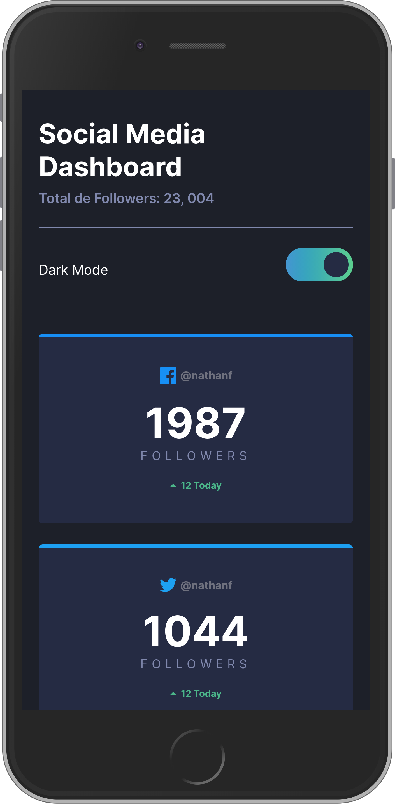

# React.JS live course

- Try the live demo point_right https://jasanhdz.github.io/reactjs-social-media/

We build a social network manager with dark mode support

- React basics
- How components works
- Componentization
- Components inside components
- ES6 modules in React
- UseRef Hook
- UseEffect Hook
- UseState Hook

## ¿Cómo funciona?

Requiere Node.JS 10

-   `yarn install` para instalar las dependencias.
-   `yarn dev` para el entorno de desarrollo.
-   `yarn build` para el entorno de producción.

## Licencia

MIT